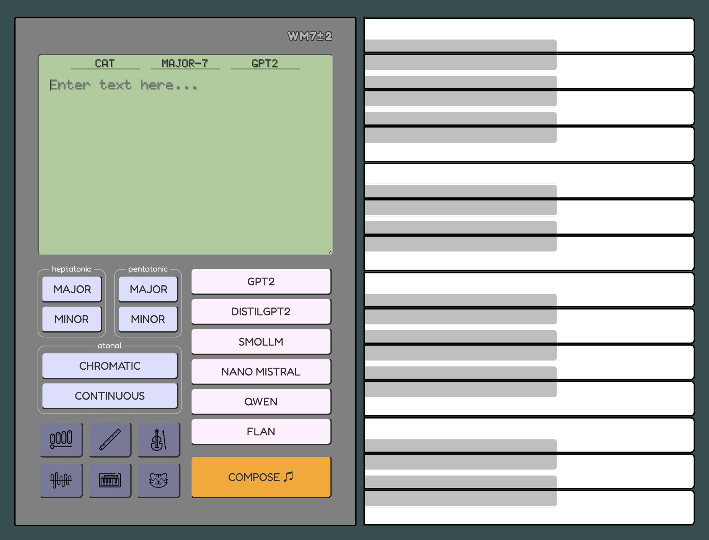

# Surprisal Calculator WM7±2

> Converting the surprisingness of language into musical compositions

**Live Demo**: https://surprisal.onrender.com  
**API**: https://surprisal.onrender.com/process/

An innovative web application that bridges linguistics and music by calculating text "surprisal" values using large language models and translating them into musical compositions. Built by [David Feil](https://github.com/wobblybits) and [Elise Kim](https://github.com/elisekim) during a batch at the [Recurse Center](https://www.recurse.com/).




## 🎵 What is Surprisal?

**Surprisal theory** suggests that the more surprising a word is in context, the longer it takes the human brain to process. Consider these sentences:

- "The man fed the **cat** some tuna." *(low surprisal)*
- "The lawyer presented the **cat** with a lawsuit." *(high surprisal)*

The word "cat" is far more surprising in the legal context! This "surprisingness" can be quantified using Claude Shannon's information theory formula:

```
Surprisal(x) = -log₂ P(x | context)
```

## 🎹 How It Works

1. **Text → Music**: Input text → Calculate word surprisal → Map to musical pitches → Generate melody
2. **Music → Text**: Play musical notes → Find words with matching surprisal values → Generate coherent text

The application uses multiple language models (GPT-2, SmolLM, Qwen, etc.) to calculate probability distributions and supports various musical scales and instruments.

## ✨ Features

### Core Functionality
- **Multi-Model Support**: 6 different language models for surprisal calculation
- **Musical Mapping**: Convert surprisal values to multiple musical scales
- **Reverse Generation**: Generate text from musical input
- **Real-time Audio**: Play compositions with realistic instrument sounds

### Technical Features
- **Production Ready**: Rate limiting, CSRF protection, health monitoring
- **Configurable**: Environment-based configuration for all settings
- **Scalable**: Redis-backed rate limiting, containerized deployment
- **Accessible**: Screen reader support, keyboard navigation
- **Developer Friendly**: Comprehensive API documentation, Docker setup

## 🚀 Quick Start

### Prerequisites
- Python 3.8+
- Docker (optional, for containerized deployment)
- Redis (optional, falls back to memory-based rate limiting)

### Option 1: Local Development

```bash
# Clone and setup
git clone https://github.com/wobblybits/surprisal.git
cd surprisal
./setup-dev.sh

# Start development server
./run-dev.sh
```

### Option 2: Docker Development

```bash
# Clone and start with Docker
git clone https://github.com/wobblybits/surprisal.git
cd surprisal/docker
./run-development.sh
```

### Option 3: Production Deployment

```bash
# Production deployment with Docker
cd docker/
./run-production.sh
```

Visit http://localhost:8001 (local/dev) or http://localhost (production) to use the application.

## 🛠️ Configuration

Configure the application using environment variables. Copy `.env.example` to `.env`:

```bash
cp .env.example .env
```

### Key Configuration Options

| Variable | Description | Default |
|----------|-------------|---------|
| `FLASK_SECRET_KEY` | Secret key for sessions (required in production) | - |
| `MAX_TEXT_LENGTH` | Maximum input text length | 1000 |
| `RATE_LIMIT_PER_MINUTE` | API requests per minute | 10 |
| `RATE_LIMIT_PER_HOUR` | API requests per hour | 100 |
| `RATE_LIMIT_STORAGE_URL` | Redis URL for rate limiting | `memory://` |
| `CSRF_ENABLED` | Enable CSRF protection | `True` |

See `.env.example` for all available options.

## 📖 API Documentation

The application provides a RESTful API for programmatic access:

### Core Endpoints

- `POST /process/` - Convert text to surprisal values
- `POST /reverse/` - Generate text from musical notes  
- `GET /health` - Application health and status
- `GET /debug_tokens/{model}` - Debug tokenization

### Example API Usage

```bash
# Convert text to musical data
curl -X POST http://localhost:8001/process/ \
  -H "Content-Type: application/json" \
  -d '{"text": "The cat sat on the mat", "model": "gpt2"}'

# Generate text from musical note
curl -X POST http://localhost:8001/reverse/ \
  -H "Content-Type: application/json" \
  -d '{"text": "The cat", "note": 5, "model": "gpt2"}'
```

**Full API Documentation**: Open `api-docs.yaml` in [Swagger Editor](https://editor.swagger.io/) for interactive documentation.

## 🐳 Docker Deployment

All Docker-related files are organized in the `docker/` directory:

### Development
```bash
cd docker/
./run-development.sh
```
- Hot reload enabled
- Debug mode on
- Relaxed rate limits
- Direct Redis access

### Production  
```bash
cd docker/
./run-production.sh
```
- Nginx reverse proxy
- Rate limiting and caching
- Security headers
- Persistent storage

See [`docker/README.md`](docker/README.md) for detailed Docker documentation.

## 🏗️ Architecture

### Backend (Python/Flask)
- **Language Models**: Multiple HuggingFace transformers for surprisal calculation
- **Audio Processing**: Tone.js integration for real-time audio synthesis
- **Security**: Rate limiting, CSRF protection, input validation
- **Monitoring**: Health checks, error handling, logging

### Frontend (JavaScript ES6)
- **Modular Design**: Separate configs, utilities, and main application
- **Audio Engine**: Tone.js for synthesis with multiple instrument presets  
- **Real-time UI**: Dynamic keyboard highlighting, visual feedback
- **Accessibility**: Screen reader support, keyboard navigation

### Repository Structure
```
├── app.py                     # Main Flask application
├── assets/js/
│   ├── config.js             # Configuration and presets
│   ├── surprisal-app.js      # Main application logic
│   └── utilities.js          # Helper functions and error handling
├── templates/wireframe.html   # Main UI template
├── requirements.txt          # Python dependencies
├── api-docs.yaml            # OpenAPI specification
├── docker/                  # Docker deployment files
│   ├── Dockerfile           # Production container
│   ├── Dockerfile.minimal
│   ├── docker-compose.yml
│   ├── docker-compose.dev.yml
│   ├── nginx.conf
│   ├── run-production.sh
│   ├── run-development.sh
│   └── README.md
└── .env.example
```

## 🎼 Musical Features

### Supported Instruments
- **Synthesized**: Piano, Violin, Flute, Theremin, Xylophone
- **Sampled**: Cat sounds (for fun!)

### Musical Scales
- **Heptatonic**: Major 7th, Minor 7th
- **Pentatonic**: Major 5th, Minor 5th  
- **Atonal**: Chromatic, Continuous pitch

### Audio Processing
- **Dynamic Volume**: Based on word frequency
- **Note Duration**: Based on word length
- **Real-time Playback**: Visual highlighting synchronized with audio

## 🔬 Language Models

| Model | Size | Description |
|-------|------|-------------|
| **GPT-2** | 124M | OpenAI's foundational model |
| **SmolLM** | 135M | Hugging Face's optimized small model |
| **Nano Mistral** | 170M | Compact Mistral variant |
| **Qwen 2.5** | 494M | Multilingual question-answering model |
| **Flan T5** | 74M | Google's text-to-text transformer |

Each model has different tokenization and surprisal characteristics, leading to unique musical interpretations.

## 🚦 Development

### Local Development
```bash
# Activate virtual environment
source venv/bin/activate

# Start development server
python app.py
```

### Docker Development
```bash
# Start development environment
cd docker/
docker-compose -f docker-compose.dev.yml up -d

# View logs
docker-compose -f docker-compose.dev.yml logs -f
```

### Testing
```bash
# Health check
curl http://localhost:8001/health

# Test text processing
curl -X POST http://localhost:8001/process/ \
  -H "Content-Type: application/json" \
  -d '{"text": "Hello world", "model": "gpt2"}'
```

## 📊 Monitoring

### Health Monitoring
- **Endpoint**: `GET /health`
- **Metrics**: Uptime, model status, configuration
- **Use Cases**: Load balancer health checks, monitoring systems

### Rate Limiting
- **Default**: 10 requests/minute, 100 requests/hour
- **Storage**: Redis (production) or memory (development)
- **Headers**: Rate limit information in response headers

## 🔗 Links and References

### Academic Sources
- [Testing the Predictions of Surprisal Theory in 11 Languages](https://aclanthology.org/2023.tacl-1.82/) (Wilcox et al., TACL 2023)
- [Expectation-based syntactic comprehension](https://doi.org/10.1016/j.cognition.2007.05.006) (Levy, Cognition 2008)
- [A mathematical theory of communication](https://doi.org/10.1002/j.1538-7305.1948.tb01338.x) (Shannon, 1948)

### Models and Assets
- Language models from [Hugging Face](https://huggingface.co/)
- Audio synthesis with [Tone.js](https://tonejs.github.io/)
- Icons from [Flaticon](https://www.flaticon.com/)
- Fonts from [Google Fonts](https://fonts.google.com/) and [Old School PC Fonts](https://int10h.org/oldschool-pc-fonts/)

## 📄 License

This project is open source. Built with ❤️ at the Recurse Center.

---

**Questions or feedback?** This project represents a unique intersection of linguistics, music theory, and web development. While considered complete, we welcome discussion about the concepts and implementation!